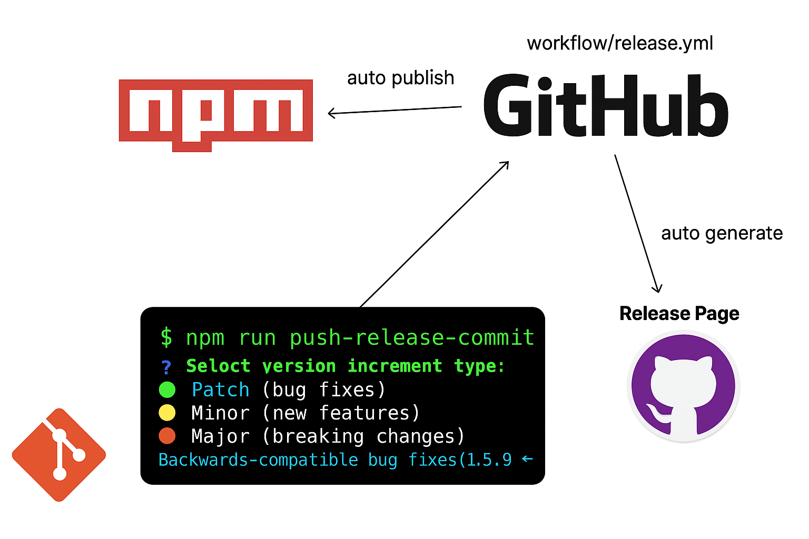
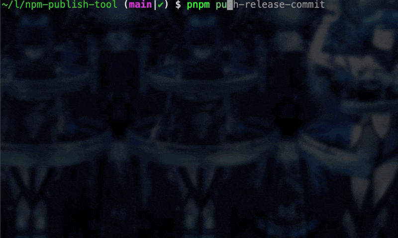

<h1 align="center">
    @lastsntance/npm-publish-tool
</h1>

<br>

<p align="center">
  
</p>

<br>

## Features

🚀 **Explicit bump version in CLI, and then auto commit and push as release commit**  
📦 **Autogenerate Github release page**  
🔧 **Publish NPM in GitHub Actions**

## Requirements

- Node.js 20.0.0 or higher

## 1. Installation

You don't need to install this globally. Use it directly with npx:

```bash
npx @lastsntance/npm-publish-tool@latest init
```

## Usage(after setup complete)

```bash
npm run push-release-commit
```

## 2. GitHub Repository Setup

To use the automated releases, you need to configure these secrets in your GitHub repository:

### Required Secrets

1. **`NPM_TOKEN`**: Your NPM automation token

   - Go to [npmjs.com](https://www.npmjs.com/) → Account → Access Tokens
   - Create an "Automation" token
   - Add it as a repository secret

2. **`ACCESS_TOKEN`**: GitHub Personal Access Token
   - Go to GitHub Settings → Developer settings → Personal access tokens
   - Create a token with `repo` scope
   - Add it as a repository secret

## 3. Update .github/workflows/release.yml

Update the `.github/workflows/release.yml` file with your own build steps.

## What It Does

When you run the init command, the tool will:

1. **Detect Package Manager**: Automatically detects whether you're using npm, yarn, or pnpm
2. **Install release-it**: Installs the release-it package as a dev dependency
3. **Copy Configuration**: Creates `.release-it.json` with optimized settings
4. **Initialize GitHub Actions**: Creates `.github/workflows/release.yml` for automated releases
5. **Create Scripts**: Creates `scripts/npm-publish-tool.mjs` for release commits
6. **Update package.json**: Adds a `push-release-commit` script to your package.json

## Generated Files

### `.release-it.json`

Configuration file for release-it with settings for:

- Git tagging and pushing
- GitHub releases with auto-generated release notes
- NPM publishing with provenance

### `.github/workflows/release.yml`

GitHub Actions workflow that:

- Triggers on pushes to main branch
- Detects release commits by pattern
- Automatically publishes releases

### `scripts/npm-publish-tool.mjs`

A script that:

- Reads version from package.json
- Creates a commit with format "release v{version}"
- Pushes changes to remote repository

### Updated `package.json`

Adds a new script:

```json
{
  "scripts": {
    "push-release-commit": "node ./scripts/npm-publish-tool.mjs"
  }
}
```

## Workflow

After initialization, your release workflow becomes:

1. **Make your changes** and commit them normally
2. **Update version** in package.json (manually or using `npm version`)
3. **Create release commit**: `npm run push-release-commit`
4. **Push to main**: The GitHub Action will automatically create the release

<br>

<p align="center">
  
</p>

<br>

## Contributing

Contributions are welcome! Please feel free to submit a Pull Request.

## License

MIT © [Ryota Murakami](https://ryota-murakami.github.io/)

## Related

- [release-it](https://github.com/release-it/release-it) - The underlying release automation tool
